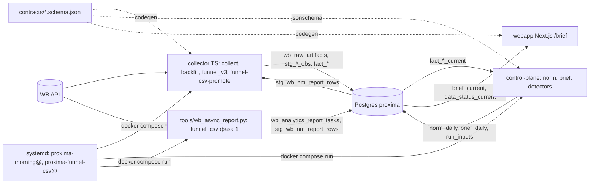
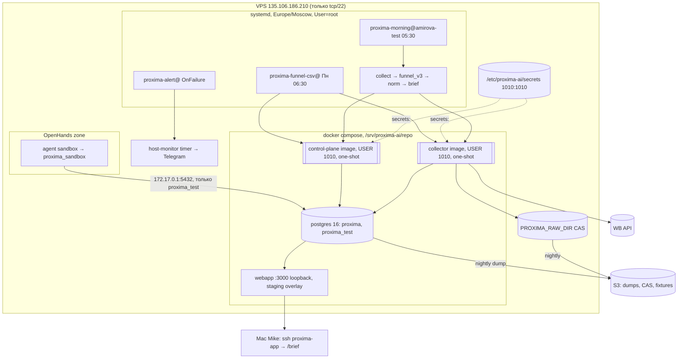
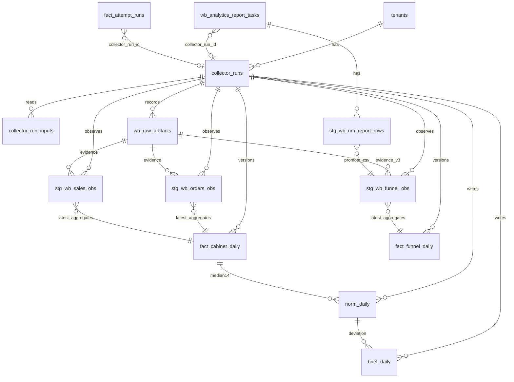

# Architecture Spine — wb-morning-brief

## Design Paradigm

**Pipes-and-filters над неизменяемым реестром доказательств.** Каждый фильтр читает слева и пишет справа, никогда наоборот; каждая запись справа несёт `run_id` и ссылку на доказательство слева; «текущее» состояние - всегда view поверх версий, никогда мутация строки.

| Слой | Что | Где |
| --- | --- | --- |
| Evidence | сырые ответы WB как есть, CAS по sha256 | `services/collector/src/business-signal/{http,raw-store}.ts` (переиспользуется), реестр `wb_raw_artifacts` (новый) |
| Observations | построчные наблюдения WB: одна строка = одно наблюдение ключа с его `lastChangeDate` | `stg_wb_orders_obs`, `stg_wb_sales_obs`, `stg_wb_funnel_obs` (новые); `stg_wb_nm_report_rows` (есть, CSV) |
| Facts | версии агрегатов по прогону + view `_current` | `fact_cabinet_daily`, `fact_funnel_daily` (новые); `fact_order_counts` (есть, nmId из CSV) |
| Norm / Signals | норма и отклонения, чистые функции | `services/control-plane/src/proxima_control_plane/{norm,brief,detectors}` |
| Brief | материализованная сводка на дату | `brief_daily` (новая) |
| Presentation | `/brief` только читает view | `services/webapp/src/lib/data/postgres-provider.ts` |

## Invariants & Rules

### AD-1 — Доказательство раньше факта, один реестр прогонов [ADOPTED]

- **Binds:** CAP-1, CAP-2, CAP-6
- **Prevents:** факты без источника; артефакты в чужом реестре прогонов (`business_signal_runs`), которые `delete_run` не видит; два формата locator
- **Rule:** любой ответ WB сначала пишется через `RecordedHttpClient` в существующий CAS `PROXIMA_RAW_DIR` с фактическим префиксом `artifact://business-signal/sha256/<hex>` (`raw-store.ts` не меняется; переименование префикса - вместе с переездом business-signal, M-04) и строкой `wb_raw_artifacts(artifact_id, tenant_id, run_id → collector_runs ON DELETE CASCADE, source official_wb_statistics|official_wb_analytics, endpoint, http_status, safe_headers, content_sha256 CHECK '^artifact://business-signal/sha256/[0-9a-f]{64}$' на locator, retrieved_at)`, и только затем парсится. Строка артефакта коммитится сразу по получении (доказательство переживает сбой прогона). Наблюдение и факт ссылаются на `content_sha256`. Файлы CAS неизменяемы и при удалении прогона остаются. `business_signal_raw_artifacts` и business-signal pipeline не трогаются до M-04.

### AD-2 — Наблюдения с естественным ключом, факты - версии каждого дня интервала

- **Binds:** CAP-1, CAP-2, CAP-4, CAP-5
- **Prevents:** `DO NOTHING`, теряющий позднюю отмену (тот же `srid`, новый `lastChangeDate`, до 2 недель); версия дня из строк одного прогона; день без строк, неотличимый от «не собирали»; дыра после простоя таймера; два определения «заказов»
- **Rule:** `stg_wb_orders_obs` PK `(tenant_id, srid, last_change_at)`, `stg_wb_sales_obs` PK `(tenant_id, sale_id, last_change_at)`; колонки `run_id`, `content_sha256`, `payload jsonb`, `canonical_sha256`. Повтор PK с тем же `canonical_sha256` - `DO NOTHING`; тот же PK с другим payload - прогон падает `WB_SCHEMA_DRIFT` (как `wb-client.ts`). View `stg_wb_orders_latest` / `stg_wb_sales_latest` = `DISTINCT ON (tenant_id, key) ORDER BY last_change_at DESC`, без фильтра по статусу прогона (наблюдение = доказательство) - единственный вход агрегатора. `fact_cabinet_daily(tenant_id, calendar_day, run_id, orders_count, cancelled_count, sales_count, returns_count, revenue_rub, forpay_rub, evidence_sha256[])`, зерно день кабинета в МСК по WB `date`, формулы - `glossary.md`. Агрегатор версионирует **каждый** день интервала `[floor, run_day-1]` из `_latest`, включая дни без строк (версия с нулями и артефактами прогона); `floor = mskDay(dateFrom)` для `collect`, `--from + 1` для `backfill` (первый день ответа отброшен как усечённый окном WB); дни `< floor` и `= run_day` не версионируются. `dateFrom` для `collect` = `min(run_day-3, last_full_day+1)` - самолечение после простоя. Бэкфилл из сохранённого ответа: два артефакта 30.08 (`supplier-sales` и `supplier-orders`, `flag=0`) импортируются в CAS `PROXIMA_RAW_DIR` (владелец 1010) и регистрируются в `wb_raw_artifacts` прогона `backfill`; `backfill --source artifact:<sha256_sales>,<sha256_orders> --retrieved-at <ISO>` парсит их как обычный ответ (`retrieved_at` берётся из манифеста CAS, флаг обязателен, если манифеста нет), `run_day := mskDay(retrieved_at)` (30.08.2026); импорт файла в CAS с манифестом - `tools/cas_import.ts <file> --retrieved-at <ISO> --source <official_wb_*>`, тот же инструмент сидирует CAS в harness, версии только до `run_day-1`; живой хвост - `collect --date-from <run_day-3 артефакта>` с перекрытием. Агрегатор пишет в `collector_run_inputs` distinct `run_id` всех наблюдений, вошедших в свёртку. «Заказы кабинета» берутся только отсюда; `fact_order_counts` (nmId, `ordersCount` из CSV) - воронка, их сумма никогда не подменяет кабинетный ряд (сверка - Deferred, M-04). Первая единица M-01 проверяет на фикстурах `count(*) = count(distinct srid)` и семантику `flag=0` (AD-4) до реализации агрегатора.

### AD-3 — Модель прогона: три вида транзакций; «текущее» одно; удаление транзитивно

- **Binds:** all
- **Prevents:** ROLLBACK, уносящий строку прогона; наблюдения, приписанные упавшему прогону; `_current`, указывающий на удалённое доказательство; `delete_run`, удаляющий 0 строк под RLS
- **Rule:** `collector_runs(run_id uuid PK, tenant_id, kind collect|backfill|funnel_v3|funnel_csv_download|funnel_csv_promote|norm|brief, started_at, finished_at, status RUNNING|SUCCEEDED|FAILED, git_sha, image_id, notes)`; `collector_run_inputs(tenant_id, run_id, input_run_id)`. Прогон = (1) `INSERT collector_runs … RUNNING` autocommit; (2) каждая строка `wb_raw_artifacts` autocommit по получении; (3) парсинг → наблюдения → версии → `run_inputs` → `UPDATE … SUCCEEDED` - одна транзакция; GUC `proxima.tenant_id` ставится на сессию при подключении (`set_config(…, false)` первым statement соединения), поэтому autocommit-шаги (1)-(2) и транзакция (3) проходят RLS `WITH CHECK` одинаково; при ошибке - ROLLBACK (3) и отдельный autocommit `UPDATE … FAILED`. Частичных наблюдений и версий не существует. Python-jobs - та же схема, `set_config` на соединении (соединение живёт один прогон). Все новые таблицы: `run_id NOT NULL REFERENCES collector_runs ON DELETE CASCADE`; `*_current` = строки прогона с максимальным `finished_at` среди `status='SUCCEEDED'` на ключ. `tools/delete_run.py --tenant <t> --run <uuid> [--dry-run]` - оба флага обязательны, первый statement `set_config`, удаляет транзитивное замыкание по `collector_run_inputs` (входы → зависимые; удаление бэкфилла = замыкание на все `collect`, это документированная полная переборка) и печатает счётчики; для FAILED-прогона удаляет только строку прогона и его артефакты. Роль `proxima_run_janitor` NOLOGIN создаётся в ledger (011) с политикой `FOR ALL` на каждую таблицу с `run_id`; LOGIN-член и `GRANT DELETE` - в bootstrap (AD-11). RLS-тест в `make verify`: `delete_run` без GUC обязан упасть «0 строк для run_id», не завершиться нулями. Существующие `fact_attempt_runs`, `wb_analytics_report_tasks` получают `collector_run_id uuid NULL` (аудит, без CASCADE).

### AD-4 — Один WB-клиент с реестром эндпоинтов; сеть в тестах запрещена

- **Binds:** CAP-1, CAP-2, CAP-6
- **Prevents:** второй http-клиент без записи артефактов; ручные `sleep`; тесты, жгущие лимиты; эндпоинты, запрещённые гейтом
- **Rule:** `services/collector/src/wb/client.ts` + `src/wb/recording-client.ts` - собственная тонкая обёртка с тем же порядком, что у `business-signal/http.ts` (артефакт в CAS до проверки статуса, allowlist безопасных заголовков), переиспользующая `raw-store.ts` и `fetchTransport`; `RecordedHttpClient` и его `SignalRepository` остаются business-signal и не трогаются. Транспорт и приёмник инжектируются: интерфейс `ArtifactSink`, реализация `WbArtifactSink` пишет в `wb_raw_artifacts` с реестром: `statistics.orders` (10/мин), `statistics.sales` (1/мин), `analytics.sales_funnel_v3_history` (3/мин, окно ≤ 7 дней, ≤ 20 nmId), `analytics.nm_report_downloads` (3/мин, список). `reportDetailByPeriod` и `supplier/stocks` в реестр не входят. 429 - ожидание по `X-Ratelimit-Retry`, не более 3 повторов. Новый гейт `tools/verify_wb_client.py` в `make verify`: реестр = единственное место URL в `src/wb/` и `src/jobs/`, запрет `setInterval`/`node-cron` на `src/**`, запрет write-эндпоинтов; `tools/verify_business_signal.py` не меняется. Тесты: `FixtureTransport` читает `services/collector/tests/fixtures/wb-api/<api>/<endpoint>/*.json` (обезличено, ≤ 200 КБ, без заголовков авторизации; коммитятся); полные ответы - VPS `~/signal-inputs/fixtures/wb-api/` + S3; `tools/record_fixture.ts` копирует артефакт прогона в фикстуру с обезличиванием. В тестовом окружении `WB_*_TOKEN_FILE` не заданы - сетевой вызов падает. [ASSUMPTION] инкремент `orders`/`sales` = `dateFrom, flag=0` возвращает строки с `lastChangeDate ≥ dateFrom` - проверить двумя read-вызовами с сервера в первой единице M-01; если фильтр по дате продажи - `dateFrom = run_day-14`.

### AD-5 — Воронка: два источника, один словарь, одна таблица фактов

- **Binds:** CAP-6, CAP-7
- **Prevents:** два писателя воронки с разными полями; факты из CSV мимо наблюдений; повтор после `delete_run` = no-op; разделяемая квота отчётов (D20)
- **Rule:** `stg_wb_funnel_obs` PK `(tenant_id, nm_id, calendar_day, source v3|csv, canonical_sha256)` с `run_id`, `observed_at` и полями словаря `COLUMN_MAP` scn001: `open_card, cart, orders, orders_sum_rub, buyouts, buyouts_sum_rub`, `evidence_sha256`. Job `funnel_v3` (TS) ежедневно запрашивает окно 7 дней по активным nmId пакетами ≤ 20. `fact_funnel_daily_current` выбирает по правилу AD-3, `_latest` наблюдений - `DISTINCT ON (ключ без sha) ORDER BY observed_at DESC`. Job `funnel_csv` (понедельник 06:30 МСК, после утреннего юнита) = два прогона `collector_runs`: `funnel_csv_download` (фаза 1, строку прогона создаёт сам `wb_async_report.py` под owner-URI) и `funnel_csv_promote` (фаза 2, TS): (1) `tools/wb_async_report.py` под owner-URI (единственное исключение из AD-11 до переноса в TS, пересмотр в M-04; автосоздание `tenants` из скрипта удаляется - tenant обязан существовать), не более одного созданного отчёта в сутки, перед созданием - проверка `nm_report_downloads`; (2) промоушен `stg_wb_nm_report_rows(task_id)` → `stg_wb_funnel_obs(source='csv', evidence = tasks.downloaded_sha256)` → `fact_funnel_daily` под `proxima_job_collector` из TS-шага `jobs/funnel-csv-promote.ts` - всегда, независимо от состояния задачи; повтор после `delete_run` пересоздаёт только фазу 2; `--period from..to` явный для ручных повторов. `fact_funnel_daily(tenant_id, nm_id, calendar_day, source, run_id, …)`; `fact_funnel_daily_current` предпочитает `csv` над `v3`. [ASSUMPTION] создание/статус/скачивание async CSV и глубина `startDate` (до года по спеке) не вызывались - проверить не более чем 3 вызовами в единице CAP-6 до реализации фазы 2.

### AD-6 — Расписание снаружи процесса: один утренний юнит, контейнерные one-shot шаги

- **Binds:** CAP-1, CAP-5, CAP-6
- **Prevents:** in-process таймеры; независимые таймеры без зависимости от успеха; toolchain на хосте (нет uv/psql/node_modules); юнит без прав на docker; секреты, нечитаемые в контейнере
- **Rule:** `infra/systemd/proxima-morning@.service` + `.timer` (`OnCalendar=*-*-* 05:30:00 Europe/Moscow`, `Persistent=true`; на `.service` - `OnFailure=proxima-alert@%n.service`) запускает `tools/morning_run.sh <tenant>`: шаги `collect → funnel_v3 → norm → brief` строго последовательно, стоп на первой ошибке, каждый шаг - свой прогон. `proxima-funnel-csv@.timer` - понедельник 06:30 МСК. Имена: `kind` в БД с `_` (`funnel_v3`), юниты с `-` (`proxima-funnel-csv@`), маппинг только здесь. Юниты: `User=root`, `ProtectHome=true`, без `ProtectSystem=strict`/`PrivateDevices` (нужен docker CLI). Шаги = `docker compose --profile jobs run --rm collector|control-plane …` из `/srv/proxima-ai/repo`; образы `services/collector/Dockerfile`, `services/control-plane/Dockerfile` (multi-stage, контекст - корень репо, корневой `.dockerignore`: `.env`, `.git`, `node_modules`, `fixtures/`, `_bmad-output/`), процессы в контейнерах `USER 1010` (`proxima-jobs`); все `/etc/proxima-ai/secrets/*_uri` и `<tenant>_wb_*_token` - `1010:1010 0600`, монтируются через compose `secrets:`; `morning_run.sh` передаёт `PROXIMA_GIT_SHA=$(git rev-parse HEAD)` и `PROXIMA_IMAGE_ID=$(docker image inspect -f '{{.Id}}')` в env. `psql`/`pg_dump` - через `docker compose exec postgres`. `proxima-alert@.service` шлёт в Telegram-канал монитора. Бэкфилл = `collect --from 2026-03-01 --backfill` вручную один раз при первом деплое M-01: `sales` 1/мин, при 80 000 строк в ответе - продолжение с `dateFrom = lastChangeDate` последней строки. [ASSUMPTION] хост-таймеры + контейнерные one-shot вместо `ofelia`/cron в compose - на хосте уже живёт `proxima-host-monitor.timer`.

### AD-7 — Время, «полный день» и `stale` определены в одном месте

- **Binds:** CAP-1, CAP-3, CAP-4, CAP-5
- **Prevents:** день по UTC в одном job и по МСК в другом (`date-window.ts:29`); `stale = NULL`, читаемый как «свежо»; `CURRENT_DATE` контейнера (UTC) в SQL
- **Rule:** `calendar_day` = дата поля WB `date` в `Europe/Moscow` через единственный helper `mskDay()` (TS) / `msk_day()` (Python) / SQL-форму `(now() AT TIME ZONE 'Europe/Moscow')::date` (в `db/` `CURRENT_DATE` запрещён), с тестом на границу полуночи; моменты - `TIMESTAMPTZ`; `OnCalendar` всегда с явным `Europe/Moscow`. Полный день = `calendar_day < run_day` **и** есть версия в `fact_cabinet_daily_current`. View `data_status_current`: `last_full_day`, `collected_at` (finished_at последнего SUCCEEDED прогона `kind IN ('collect','backfill')`), `stale = COALESCE(collected_at < now() - interval '24 hours' OR last_full_day < msk_today - 1, true)`. `stale` вычисляется только этим view; `brief_daily.status` копирует его на момент записи; webapp читает view.

### AD-8 — Норма считается один раз и материализуется

- **Binds:** CAP-4, CAP-5, CAP-7
- **Prevents:** webapp и детектор с разными «нормами»; окно, включающее оцениваемый день; скрытые пропуски; две версии нормы на день без правила выбора
- **Rule:** `proxima_control_plane/norm/` (чистые функции + `loader` через psycopg под `proxima_job_norm`; `psycopg` переносится в `dependencies`) читает `fact_cabinet_daily_current`; `evaluation_day` = последний полный день; окно = календарные дни `[evaluation_day-14, evaluation_day-1]`; `sample_days` = дни окна с версией; медиана по имеющимся; `sample_days < 14` → `status=insufficient` (пропуск виден). Пишет `norm_daily(tenant_id, evaluation_day, metric orders|revenue, window_days, sample_days, value numeric(14,2), status, run_id)` с `UNIQUE (tenant_id, evaluation_day, metric, run_id)` и view `norm_daily_current` по правилу AD-3. Сводка и детекторы читают `norm_daily_current`; `scn001` (ветка `pmm-20`) подключается в M-04 через адаптер `loader.py` → `fact_*_current`, его окна 7/14/28 со средним остаются внутри сценария. [ASSUMPTION] окно исключает оцениваемый день - D21 явно не сказал.

### AD-9 — Сводка материализована, webapp - только читатель

- **Binds:** CAP-3, CAP-5, CAP-7, CAP-8
- **Prevents:** бизнес-логика в Next.js; SQL в компонентах; вчерашняя сводка, показанная как свежая; ручные типы, расходящиеся с контрактом
- **Rule:** `proxima_control_plane/brief/` читает `norm_daily_current WHERE evaluation_day = brief_day`, пишет `run_inputs` и `brief_daily(tenant_id, brief_day, run_id, status ok|insufficient|blocked, payload jsonb)`; `payload` валиден по `contracts/brief.schema.json` (`data_status`, `evaluation_day`, `actual{orders, revenue}`, `norm{orders, revenue, window_days, sample_days}`, `deviation_pct{orders, revenue}`, `signals[]` по `contracts/signal.schema.json` v1 - пусто до M-04, `source_refs[]`). View `brief_current` = ровно одна строка на tenant (SUCCEEDED с max `brief_day`, при равных - max `finished_at`). Webapp `postgres-provider.ts` владеет собственным `Pool`: `pool.on('connect', c => c.query("select set_config('proxima.tenant_id',$1,false)",[tenant]).catch(…))`, `WEBAPP_TENANT_ID` обязателен и валидируется `^[a-z0-9][a-z0-9_-]{2,63}$` при старте; ровно два `SELECT` под `proxima_webapp_readonly` из `brief_current` и `data_status_current`. Цифры показываются только при `brief.status = 'ok' AND data_status.stale IS FALSE AND brief.brief_day = data_status.last_full_day`; иначе предупреждение с `last_full_day` и `collected_at`. `WEBAPP_DATA_MODE=postgres` до первого SUCCEEDED `brief` работает в режиме «только статус»: `getBrief()` отдаёт fixtures-brief с пометкой «сводка ещё не считается», строка статуса - из `data_status_current`; полная сводка - после первого SUCCEEDED `brief`.

### AD-10 — Контракты как JSON Schema, типы генерируются [ADOPTED]

- **Binds:** CAP-4, CAP-5, CAP-7, CAP-8
- **Prevents:** дрейф `types.ts` (ai/pa-50) против `signal.schema.json` (pmm29) против `DiagnosisInput`
- **Rule:** формы данных через границу сервиса - схемы в `contracts/`: принять `signal`, `diagnosis`, `decision-record` из `pmm29-contracts`, добавить `cabinet-daily`, `norm`, `brief`. Владелец `brief` и `norm` - control-plane (пишущая сторона). TS - `make codegen` (`tools/generate_contract_types.mjs` расширяется на `services/webapp/src/lib/contracts/`); Python - `dataclass` + `jsonschema` против файла из `contracts/` (паттерн `diagnosis/validator.py`; копия схемы внутри пакета удаляется). Деньги в JSON - строка с двумя знаками, в БД `numeric(14,2)`. `schema_version` в каждом payload; несовместимое изменение = новая версия, старая читается до конца наблюдения.

### AD-11 — Роли: ledger создаёт NOLOGIN-роли, гранты и политики на базовые таблицы; bootstrap - LOGIN-пользователей и базы

- **Binds:** all
- **Prevents:** миграции, не проходящие `tools/verify_migrations.py` (запрещает `GRANT DELETE`, column-level GRANT, `REVOKE`, `CREATE DATABASE`, роли не `proxima_*`, политики вне шаблона); superuser-URI в job; `permission denied` под `security_invoker`-view
- **Rule:** все четыре NOLOGIN-роли (`proxima_job_collector`, `proxima_job_norm`, `proxima_webapp_readonly`, `proxima_run_janitor`) создаются в первой же миграции лестницы (011); каждая последующая миграция, создающая таблицу с `run_id`, в том же файле выдаёт гранты и политики всем ролям, которым таблица нужна, включая `FOR ALL` для `proxima_run_janitor`. В ledger - только `proxima_*` NOLOGIN-роли, `GRANT SELECT/INSERT/UPDATE` целиком на таблицу и политики шаблона `FOR SELECT|ALL TO <роль> USING (tenant guard) WITH CHECK (tenant guard)` **на базовые таблицы, которые читают view** (грант на view под `security_invoker` ничего не даёт): `proxima_job_collector` - `collector_runs`, `collector_run_inputs`, `wb_raw_artifacts`, `stg_wb_*_obs`, `fact_cabinet_daily`, `fact_funnel_daily`, `tenants`(SELECT); `proxima_job_norm` - SELECT `collector_runs`, `fact_cabinet_daily`, `tenants`; ALL `norm_daily`, `brief_daily`, `collector_run_inputs`, INSERT/UPDATE `collector_runs`; `proxima_webapp_readonly` - SELECT + `FOR SELECT` на `brief_daily`, `collector_runs`, `fact_cabinet_daily`, `tenants`; `proxima_run_janitor` - `FOR ALL` на всё с `run_id` (DELETE-грант вне ledger). UPDATE на `collector_runs` выдаётся целиком; правило «job меняет только `status`/`finished_at`» - конвенция + RLS-тест. Существующие `proxima_source_publisher`, `proxima_release_publisher`, `proxima_data_health_read` не трогаются. Вне ledger - `infra/bootstrap/provision-runtime-roles.sh` (идемпотентный, под superuser через `docker compose exec postgres`, строго после миграций): LOGIN `proxima_collector` (член `proxima_job_collector` и существующей `proxima_source_publisher` - для чтения `stg_wb_nm_report_rows` по политике 009), `proxima_norm`, `proxima_webapp`, `proxima_janitor` (члены ролей; janitor + `GRANT DELETE`), база `proxima_test`, LOGIN `proxima_sandbox` (CONNECT только к `proxima_test`), `REVOKE CONNECT ON DATABASE proxima FROM PUBLIC`; URI каждого - файл `/etc/proxima-ai/secrets/<user>_uri` (`1010:1010 0600`). Owner-URI (superuser) используется ровно в двух местах: `make apply-migrations` и фаза 1 `funnel_csv` (AD-5). `make verify` содержит RLS-тест на локальном PG16: под каждой ролью `SELECT count(*)` из каждого view с GUC (> 0) и без GUC (= 0, без ошибки прав).

### AD-12 — Одна боевая база, одна тестовая копия, сандбокс агента видит только копию

- **Binds:** all
- **Prevents:** тест-прогон в боевые таблицы; OpenHands с доступом к боевой базе; refresh, тихо упавший на непустой базе; сандбокс, видящий 0 строк
- **Rule:** `proxima` и `proxima_test` на одном Postgres 16. `tools/test_db_refresh.sh` (= `make test-db-refresh`): `pg_terminate_backend` сессий `proxima_test` → `DROP DATABASE proxima_test WITH (FORCE)` → `CREATE DATABASE` → `pg_dump proxima | psql -v ON_ERROR_STOP=1 proxima_test` → `GRANT SELECT ON ALL TABLES IN SCHEMA public TO proxima_sandbox` → `ALTER ROLE proxima_sandbox IN DATABASE proxima_test SET proxima.tenant_id = '<tenant>'`. Копия данных кабинета в тестовой базе - сознательно (D8). Порядок первого запуска: миграции → provision → refresh. OpenHands `.env.task` содержит URI `proxima_sandbox`; bridge `172.17.0.1:5432` используется только им. Пустые `proxima_dev` (хост и зона) выводятся в первом релизе M-01. `make verify` содержит TS↔PG harness: `tools/pg_local_roundtrip.sh` после применения миграций (pytest `apply_migrations`) выполняет `infra/bootstrap/provision-runtime-roles.sh` против одноразового PG16 (LOGIN-пользователи как в проде, пароли из временных файлов), затем `npm --workspace @proxima/collector run test:db` - только файлы `*.db.test.ts` (обычный `make test` их исключает), каждому тесту доступны DSN всех ролей через `PROXIMA_TEST_DSN_<ROLE>`; `SET ROLE` не используется. RLS-матрица теста = ожидания из грантов AD-11: у роли с грантом на базовые таблицы view отдаёт `> 0` с GUC и `0` без, у роли без гранта - `permission denied`. В `proxima_test` пользователь `proxima_sandbox` получает `BYPASSRLS` и `GRANT ALL ON ALL TABLES` (только эта база; CONNECT к `proxima` отозван) - агент видит копию целиком. Гейт для единиц, собранных в сандбоксе, - CI (`.github/workflows/verify.yml`): в зоне нет PG16 initdb, `pg-roundtrip` там `SKIP`.

### AD-13 — Tenant в каждой строке, RLS по образцу 009, view с `security_invoker`, единая схема имён секретов [ADOPTED]

- **Binds:** all
- **Prevents:** таблицы без `tenant_id` (включая `run_inputs`, `raw_artifacts`); view, проверяющие RLS от владельца; `set_config(…, true)` вне транзакции; токены с двумя схемами имён и симлинки (`O_NOFOLLOW`)
- **Rule:** каждая новая таблица: `tenant_id text NOT NULL REFERENCES tenants`, `ENABLE ROW LEVEL SECURITY`, политика шаблона AD-11; каждый view - `WITH (security_invoker = true)`. TS-job: `set_config('proxima.tenant_id', $1, true)` первым statement транзакции (3) из AD-3; Python-job - `set_config` на соединении. Tenant сентября - существующий `amirova-test`. Единственная схема имён токенов - `/etc/proxima-ai/secrets/<tenant>_wb_<category>_token`; первый релиз M-01 делает `mv` (не symlink) `wb_{statistics,analytics,finance}_token` → `amirova-test_wb_*_token` с chown `1010:1010`; канон analytics-токена - `/etc`, `~/signal-inputs/wb_analytics_token` коллектором не используется; `.env` `WB_*_TOKEN_FILE` остаётся только для `wb_api_probe.py`. `morning_run.sh <tenant>` передаёт пути по шаблону. Второй tenant = строка в `tenants` + три файла + инстанс `proxima-morning@<tenant>` без изменения схемы.

### AD-14 — Миграции additive-only с self-checksum; план номеров 011-016 [ADOPTED]

- **Binds:** all
- **Prevents:** правка старых миграций; три ветки с `010_*.sql`; политики и гранты, не проходящие гейт
- **Rule:** `db/migrations/NNN_<snake>.sql`, `BEGIN…COMMIT`, self-checksum `normalized-self-v1`, `tools/verify_migrations.py` (шаблоны политик и грантов - AD-11; пропуски в нумерации запрещены, поэтому номера в единицах работы - целевые: ветка, мержащаяся второй, перенумеровывает свои миграции с пересчётом checksum). main занял `010`; `pa41-full-w2-phase3` при мерже перенумеровывает свою `010` после 016 с пересчётом checksum; `PA-03-02-promotion` списывается как старая версия того же кода. План (целевые номера): `011` `collector_runs`, `collector_run_inputs`, `wb_raw_artifacts`, четыре NOLOGIN-роли + политики, `collector_run_id` в двух существующих таблицах; `012` `stg_wb_orders_obs`, `stg_wb_sales_obs`, view `_latest`; `013` `fact_cabinet_daily`, `fact_cabinet_daily_current`, `data_status_current`; Epic 2: `norm_daily` + `_current`, затем `brief_daily` + `brief_current`; Epic 3: `stg_wb_funnel_obs`, `fact_funnel_daily` + `_current` - каждая со своими грантами и политиками.

### AD-15 — Один канонический чекаут на сервере, релиз = образы + тег + план отката

- **Binds:** all
- **Prevents:** пять разъехавшихся копий кода; compose, монтирующий миграции из чекаута 25.08; `apply-migrations`, читающий `.env` хоста внутри контейнера
- **Rule:** канон - `/srv/proxima-ai/repo` (владелец `proxima-admin`; уже в `infra/vps-contract.json` и `initdb`-mount; `ProtectHome=true` в юнитах остаётся): первый релиз M-01 восстанавливает ему `origin`, переводит на тег `vYYYY.MM.DD-N`, выводит `~/proxima-webapp-staging` и ручной контейнер `proxima-webapp-staging`; `~/proxima-ai` - зеркало администратора, из него не деплоят. Owner-секреты (`postgres_user`/`postgres_password`) монтируются только в сервис `control-plane-admin` (цели `apply-migrations`, `funnel_csv_download`); сервисы `collector` и `control-plane` получают только URI своих ролей. Сервис `control-plane-admin` в `infra/compose.yaml`: `env_file: infra/jobs.env` (в git, без секретов: `POSTGRES_HOST=postgres`, `POSTGRES_PORT=5432`, `POSTGRES_DB=proxima`, `POSTGRES_USER_FILE=/run/secrets/postgres_user`, `POSTGRES_PASSWORD_FILE=/run/secrets/postgres_password`) + `secrets:`; цель `apply-migrations` принимает `ENV_FILE ?= .env`. Деплой только по явному «деплой»: `git fetch && git checkout <tag>` (под `proxima-admin`) → `sudo docker compose build collector control-plane webapp` → `sudo docker compose --profile jobs run --rm control-plane-admin make apply-migrations ENV_FILE=infra/jobs.env` → `sudo docker compose -f infra/compose.yaml -f infra/webapp.staging.compose.yaml up -d postgres webapp` (overlay: auth off, loopback `:3000`, `WEBAPP_DATA_MODE`, `WEBAPP_TENANT_ID`, `WEBAPP_DATA_DATABASE_URI` из секрета; Caddy-overlay - октябрь) → `systemctl enable --now proxima-morning@amirova-test.timer` → прогон `WORKS-TODAY.md` → запись в `CHANGELOG.md`. План отката записан до деплоя: `git checkout <prev-tag>` + пересборка образов + `tools/delete_run.py` для прогонов плохого релиза; миграции не откатываются, компенсируются следующей. [ASSUMPTION] канон = `/srv/proxima-ai/repo`, не `~/proxima-ai`.

### AD-16 — Направление зависимостей

- **Binds:** all
- **Prevents:** импорт между сервисами; webapp, ходящий в WB; control-plane, пишущий в staging; факты из CSV мимо наблюдений
- **Rule:** разрешённые рёбра только как на диаграмме; общий код между сервисами - только через `contracts/` и БД.



### AD-17 — Наблюдаемость и операции

- **Binds:** all
- **Prevents:** молчаливый провал сбора; сводка без сигнала «данные устарели»; бэкап без проверки восстановления
- **Rule:** каждый job пишет одну JSON-строку на событие (`run_id`, `tenant_id`, `kind`, `step`, без payload) в journald; `collector_runs` - единственный источник статуса прогонов; `OnFailure` → Telegram-канал монитора; dead-man для пользователя - `stale` на `/brief`. Ночной бэкап (`proxima-pg-backup.sh`, age, S3) остаётся; в M-01 добавляется еженедельная проверка восстановления (`proxima-restore-check@`, понедельник 06:00: последний дамп из `/var/backups/proxima` (формат `proxima-pg-backup.sh`: `pg_dump | gzip | age`) расшифровывается `age -d -i /etc/proxima-ai/secrets/backup_age_key.txt`, `gunzip | psql proxima_test` после `DROP/CREATE`, затем `SELECT count(*)` по `fact_cabinet_daily_current`; это проверка бэкапа, а `make test-db-refresh` из живой базы - для тестов). `PROXIMA_RAW_DIR` включается в тот же бэкап. Ретеншн: наблюдения, версии и артефакты не удаляются автоматически (Deferred).

### AD-18 — Заморозки на сентябрь [ADOPTED]

- **Binds:** all
- **Prevents:** единицы M-01..M-03, трогающие auth и verbatim-дерево
- **Rule:** `services/webapp/src/{lib/auth*,app/api/auth,app/login}` и `services/control-plane/src/proxima/` не изменяются до октября; `services/collector/src/business-signal/*` - только чтение и переиспользование модулей (`http`, `raw-store`, `secrets`), pipeline и `raw-store.ts` не меняются. `db/`, `infra/`, `Makefile`, `services/webapp/src/lib/db/`, `tools/` открыты для единиц M-01.

## Consistency Conventions

| Concern | Convention |
| --- | --- |
| Naming | таблицы `stg_wb_<dataset>_obs`, `fact_<grain>_daily`, view `<table>_latest` / `<table>_current`; `kind` с `_`, юниты `proxima-<job>@<tenant>` с `-`; схемы `contracts/<entity>.schema.json`; роли `proxima_job_*`, `proxima_webapp_*`, `proxima_run_*`; идентификаторы английские, документация русская |
| Ключи и время | `tenant_id text` (`amirova-test`), `run_id uuid`, `calendar_day date` в Europe/Moscow по полю WB `date` через `mskDay()`; естественные ключи WB: `srid` (orders), `saleID` (sales), `nmId`; `last_change_at TIMESTAMPTZ` из `lastChangeDate`; деньги `numeric(14,2)`, в JSON - строка |
| Записи | наблюдения append-only, `DO NOTHING` только при том же `canonical_sha256`; факты - версии по `run_id`, читаются через `_current`; `UPDATE` только `status`/`finished_at` в `collector_runs` |
| Ошибки | job падает fail-closed с ненулевым exit; ROLLBACK транзакции (3) + autocommit `FAILED`; частичных данных не существует; `delete_run.py` для FAILED удаляет строку прогона и артефакты |
| Конфигурация и секреты | Файлы в `/etc/proxima-ai/secrets/` (`1010:1010 0600`), в контейнерах `/run/secrets/<имя>` через compose `secrets:`. Имена файлов и env: `proxima_collector_uri` → `COLLECTOR_DATABASE_URI_FILE`; `proxima_norm_uri` → `NORM_DATABASE_URI_FILE`; `proxima_webapp_uri` → `WEBAPP_DATA_DATABASE_URI_FILE` (webapp читает файл, не URI в env); `proxima_janitor_uri` → `JANITOR_DATABASE_URI_FILE`; `proxima_sandbox_uri` → `DATABASE_URI` только в `.env.task` зоны; `<tenant>_wb_<category>_token` → CLI-флаги `--<category>-token-file` по образцу `stockout-signal.ts`, пути подставляет `morning_run.sh`; owner `postgres_user`/`postgres_password` → только `control-plane-admin`. Значения никогда в env/логах/артефактах; несекретные параметры - `infra/jobs.env` + флаги CLI + `dim_client_passport` |
| Логи | одна JSON-строка на событие в stdout (journald через docker): `{ts, level, run_id, tenant_id, kind, step, msg, ...}`; payload только в CAS; helper `log.ts` / `log.py` |
| Тесты | collector `node:test` + `tsx`, webapp `vitest`, control-plane `pytest`; сеть запрещена (AD-4); фикстуры в `tests/fixtures/wb-api/`; RLS-тест под каждой ролью; `make verify` - гейт на маке/CI, в сандбоксе OpenHands гейт = CI; `WORKS-TODAY.md` - регрессия до автотестов |
| Auth | `WEBAPP_REQUIRE_AUTH=false` до октября; доступ к `/brief` - ssh-туннель `proxima-app` |

## Stack

| Name | Version |
| --- | --- |
| Node.js | 22.23 (engines >=22 <23) |
| TypeScript | 5.8.3 |
| pg (node-postgres) | 8.16.3 |
| ajv | 8.20.0 |
| tsx | 4.20.3 |
| Next.js | 16.3.3 |
| React | 19.2.8 |
| drizzle-orm | 0.45.2 |
| better-auth | 1.7.1 |
| vitest | 4.1.11 |
| Python | 3.14 (uv 0.11.7) |
| psycopg | 3.3.4 |
| jsonschema | 4.25.1 |
| pytest | 8.4.2 |
| PostgreSQL | 16.10 (postgres:16.10-alpine) |
| json-schema-to-typescript | 15.0.4 |
| systemd | 255 (Ubuntu 24.04) |
| Docker Compose | v2 (rootful на хосте) |

## Structural Seed





```text
.dockerignore                                   # .env .git node_modules fixtures/ _bmad-output/
services/collector/
  Dockerfile                                    # multi-stage, контекст - корень, USER 1010
  src/wb/            # client.ts (реестр, бюджеты), transport.ts, fixture-transport.ts, msk-day.ts
  src/jobs/          # collect.ts, backfill.ts, funnel-v3.ts, funnel-csv-promote.ts
  src/facts/         # cabinet-daily.ts (из *_latest → версии всех дней интервала), funnel-daily.ts
  src/business-signal/   # существующий; переиспользуются http.ts, raw-store.ts, secrets.ts
  tests/fixtures/wb-api/ # малые обезличенные фикстуры (AD-4)
services/control-plane/
  Dockerfile                                    # uv + Python 3.14 + psycopg, USER 1010
  src/proxima_control_plane/norm/     # loader.py, median.py, writer.py, cli.py
  src/proxima_control_plane/brief/    # builder.py, cli.py
  src/proxima_control_plane/common/msk_day.py
  src/proxima_control_plane/detectors/scn001/   # из pmm-20, адаптер (M-04)
contracts/            # cabinet-daily, norm, brief, signal, diagnosis, decision-record (.schema.json)
db/migrations/        # 011_run_ledger … 016_brief_daily_roles
infra/
  compose.yaml        # + services collector, control-plane (profiles: jobs), secrets:
  jobs.env            # POSTGRES_HOST=postgres … без секретов
  webapp.staging.compose.yaml   # сентябрь: auth off, loopback
  systemd/            # proxima-morning@, proxima-funnel-csv@, proxima-alert@
  bootstrap/provision-runtime-roles.sh
services/webapp/src/lib/data/postgres-provider.ts   # из ai/pa-50, реализовать
services/webapp/src/lib/contracts/                  # codegen
tools/
  delete_run.py  morning_run.sh  record_fixture.ts  verify_wb_client.py  test_db_refresh.sh
```

## Capability → Architecture Map

| Capability / Area | Lives in | Governed by |
| --- | --- | --- |
| CAP-1 ежедневный сбор | `collector/src/jobs/collect.ts`, `stg_wb_*_obs`, `fact_cabinet_daily` | AD-1, AD-2, AD-3, AD-4, AD-6, AD-7, AD-13 |
| CAP-2 бэкфилл 26 недель | `collector/src/jobs/backfill.ts` | AD-2, AD-4, AD-6 |
| CAP-3 статус данных | view `data_status_current`, webapp | AD-7, AD-9 |
| CAP-4 норма D21 | `control-plane/norm/`, `norm_daily` | AD-8, AD-10, AD-11 |
| CAP-5 сводка на /brief | `control-plane/brief/`, `brief_daily`, webapp `postgres-provider` | AD-9, AD-10, AD-16 |
| CAP-6 воронка фоном | `jobs/funnel-v3.ts`, `jobs/funnel-csv-promote.ts`, `tools/wb_async_report.py`, `fact_funnel_daily` | AD-1, AD-3, AD-4, AD-5, AD-6 |
| CAP-7 аномалии (M-04) | `detectors/scn001` + адаптер; `brief_daily.payload.signals` | AD-8, AD-10; порог - Deferred |
| CAP-8 план действий (M-05) | `diagnosis/` (mock LLM) → `signals[].diagnosis` | AD-10; провайдер LLM - Deferred |
| Среды, роли, деплой | `infra/compose.yaml`, `infra/systemd/`, `infra/bootstrap/`, `Makefile`, Dockerfiles | AD-6, AD-11, AD-12, AD-15, AD-17 |

## Deferred

- Порог тревоги и правило сигнал/шум для M-04 - после первых живых сводок, решение Mike.
- Сверка кабинетного ряда (Statistics) с суммой nmId (CSV `ordersCount`) - quality-check в M-04.
- SKU/категорийный грейн аномалий - на `fact_order_counts` + `fact_funnel_daily`; правила ранжирования - M-04.
- Реальный LLM-провайдер для `diagnosis` и его eval-гейт - M-05.
- Второй tenant: строка + три файла токенов + инстанс таймера; онбординг-скрипт - когда появится кабинет.
- Auth, Caddy/домен (`infra/webapp.compose.yaml`) - октябрь; при переходе на transaction-pooling правило `set_config` в webapp меняется на per-transaction.
- Сборка мусора CAS, ретеншн наблюдений/версий, переименование префикса locator - вместе с переездом business-signal (M-04).
- Отказ от async CSV в пользу v3, если 8 недель v3 накопятся раньше - октябрь; перенос `tools/wb_async_report.py` в TS и снятие owner-URI-исключения - не раньше M-04.
- Ротация analytics-токена на read-only (PA-13), `~/.git-credentials` на сервере, `proxima_dev_ip` 0644 - бэклог M-01, на архитектуру не влияют.
